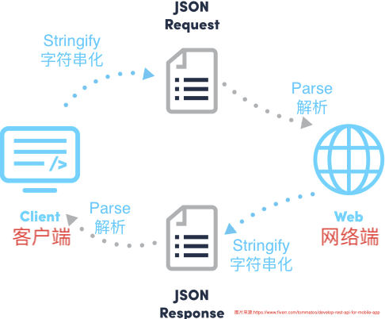

# JSON 提纲

## 1. 历史

    1.1 JavaScript成为一统江湖的前端脚本语言
    
    1.2 需要一种数据传输格式，在互联网之间传递数据 (Stringify, parse)
    

    
    1.3 JSON (JavaScript Object Notation)因为其灵活性/简易性/全面性等脱颖而出，逐渐被非常广泛的应用在多个领域，且几乎所有语言/程序都可以理解这种数据传输格式

    
## 2. JSON的组成模块

只需要三个部分，JSON就能表示任意类型的数据

    3.0 一个实际例子
```javascript
{
     "firstName": "John",
     "lastName": "Smith",
     "address": {
         "streetAddress": "21 2nd Street",
         "city": "New York",
         "state": "NY",
         "postalCode": 10021
     },
     "phoneNumbers": [
         "212 555-1234",
         "646 555-4567"
     ]
 }
```

    
    3.1 Array（类比Python中的list）
```javascript
["212 555-1234", "646 555-4567"]
```

    3.2 Object（类比Python中的dict）
    
```javascript
{
     "streetAddress": "21 2nd Street",
     "city": "New York",
     "state": "NY",
     "postalCode": 10021
 }
```

    3.3 规则允许嵌套
    “{key: value}”代表形容一个整体的事务，在JavaScript中是一个对象(object)

    "[]"代表重复性的事务，其内部的事务一般都有相似的性质(如：一串电话号码；一串地理坐标现实GPS轨迹；每个重复的对象都表示用户的一次交易，等等)
    
    
    3.4 填入的数据类型为JavaScript中的基本数据类型(非常简洁)
    - 数字
    - 字符/字符串
    
    
## 3. 常见的一些实际例子
    3.1 API(程序端口)/举例
        3.1.1 数据接口/网页反馈，如：Yahoo Finance
    3.2 在软件中存储设置选项
        3.2.1 Visual Studio Code (VS Code)
        3.2.2 Sublime Text（略）
    3.3 NoSQL数据库
        3.3.1 JSON vs. SQL（略）


## 4. 参考资料
一. 部分参考资料
1. Yahoo API: https://www.yahoofinanceapi.com/
2. Wikipedia JSON: https://en.wikipedia.org/wiki/JSON
3. VS Code: How to change font? https://www.alphr.com/vs-code-how-to-change-font/

二. 推荐资料
1. JSON 与NoSQL数据库（非“表格结构”数据库）

https://blog.couchbase.com/json-database/
https://arctype.com/blog/json-in-postgresql/
2. 一些JSON语法检查器/格式优化器网站

https://jsonlint.com/
https://jsonformatter.curiousconcept.com/
https://jsonformatter.org/


3. Mozilla官网：如何在JavaScript中使用JSON：

https://developer.mozilla.org/zh-CN/docs/Learn/JavaScript/Objects/JSON


4. W3School：使用python操作JSON：

https://www.w3schools.com/python/python_json.asp


